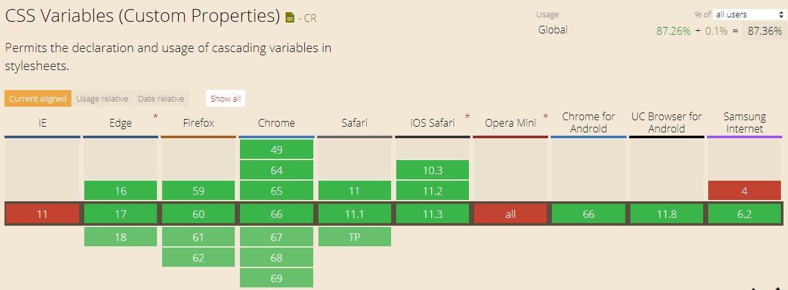
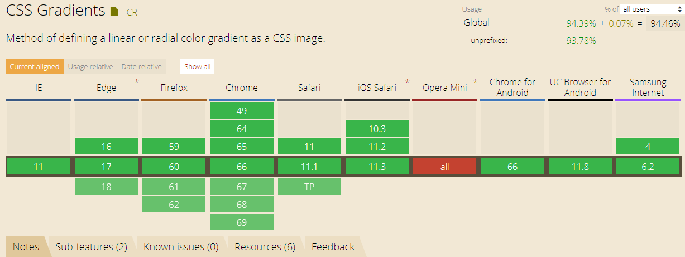
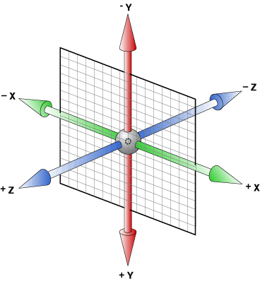
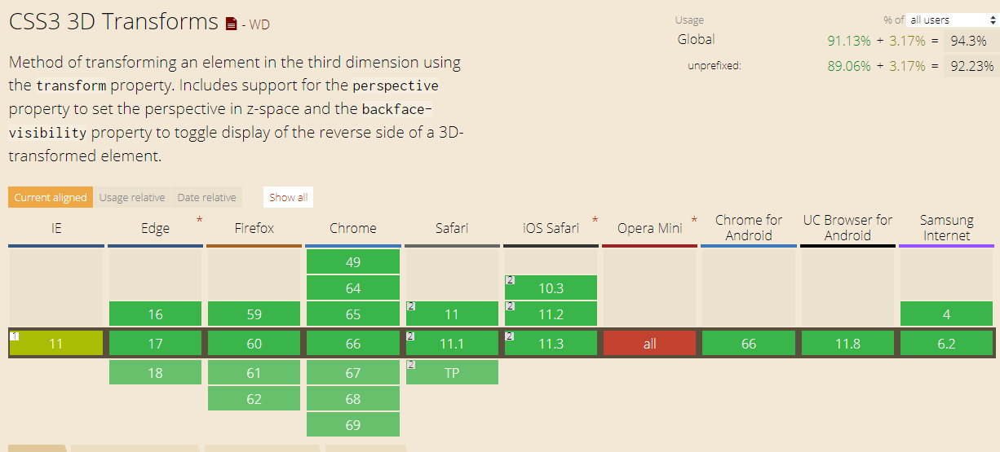
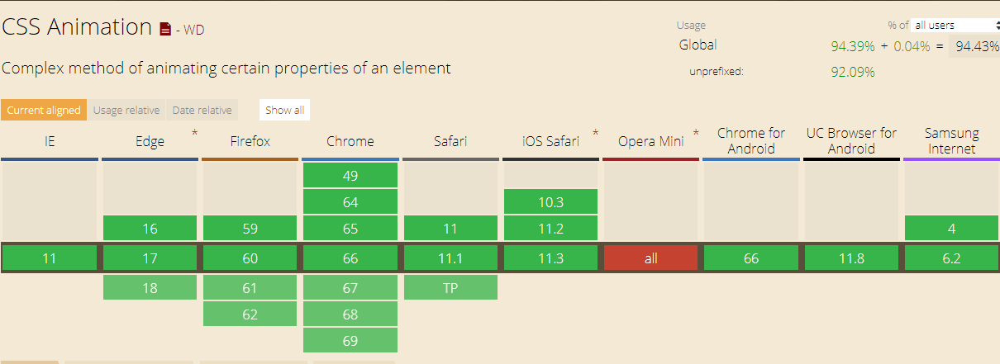
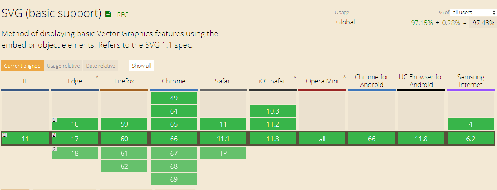

# CSS

css变量、渐变、3d变换、动画及简单应用

## 1. CSS变量

### 什么是CSS变量

当前，CSS变量有两种描述，**`CSS变量`** 和 **`CSS自定义属性`** 。

> **CSS变量**: 拥有合法标识符和合法的值。可以被使用在任意的地方。可以使用var()函数使用变量。例如：var(--example-variable)会返回--example-variable所对应的值

> **CSS自定义属性**: 这些属性使用--*where*的特殊格式作为名字。例如--example-variable: 20px;即使一个css声明语句。意思是将20px赋值给--example-varibale变量

这个是从MDN上摘抄的两段描述，其实就是定义变量和使用变量的过程。

变量必须以“--”开头，并为字母、数字、下划线和“-”的组合*(也可以是中文、日文、韩文文字)，css变量的命名同样是区分大小写的。

一般情况下会使用“-”拼接的形式进行命名，如`--header-bg`、`--header-color`。

变量使用时，必须用`var()`包裹起来，如将`--width`变量应用到宽度上，`width: var(--width);`。

如下是一个简单的使用示例，定义了`--width`变量

```css
  div{
    /* 变量定义 */
    --width: 200px;
    /* 变量使用 */
    width: var(--width);
    height: calc(var(--width) / 2)
  }
```

### CSS变量兼容性



### CSS变量使用

#### 使用`:root`来定义全局变量 [代码](https://codepen.io/LcCode/pen/XqwePg)
```css
   :root {
     --bg-color: #f00;
   }
```

#### 在特定元素下定义局部变量 [代码](https://codepen.io/LcCode/pen/mLYMvp)
```css
    div.myClass{
      --width: 100px;
    }
```

**媒体查询和伪类同样可以提供子作用域**

#### 媒体查询中的变量 [代码](https://codepen.io/LcCode/pen/MGdEWW)
```css
    @media screen and (max-width: 400px){
      :root{
        --bg-color: #00f;
      }
    }
```

#### 伪类下的变量 [代码](https://codepen.io/LcCode/pen/pVmWyo)
```css
    div:hover{
      --width: 120px;
    }
```

#### js操作css变量

css变量很大的一个好处就是它是动态的，我们可以随时通过js去改变变量的值，所有使用变量的属性也会同时改变
   
所以，利用css变量，我们可以很容易的实现许多页面效果

后面我们会看到js操作css变量的代码

#### 利用变量去操作伪类元素

改变伪元素`:before` `:after`样式

我们无法通过css选择器获取到伪元素，所以也就无法通过js来直接修改伪元素的样式。

有了css变量，就可以在父元素定义变量，然后在伪元素中使用。

我们就可以修改父元素的变量值来达到想要的效果。

**[代码](https://codepen.io/LcCode/pen/dexOGO)**
    
## 2. CSS渐变

### CSS渐变描述

css3渐变可以让你从两个或者两个以上的颜色之间显示平稳的过渡。

以前这样做需要用到图片,现在直接使用css3中的属性可以实现。

好处：

    1. 减少页面下载的时间和并节省带宽
    2. 可以放大不失真
    3. 有更强的可控性。

### CSS渐变兼容性



### 渐变分类

css渐变共有两种，线性渐变和径向渐变

#### 线性渐变

一个线性渐变，必须至少定义两种颜色结点。

颜色结点即你想要呈现平稳过渡的颜色。

同时，你也可以指定渐变的方向(角度)、每一个颜色的位置。
默认情况下，渐变的方向是向下(0deg), 第一个颜色的位置是0, 最后一个的位置是100%, 中间的所有颜色平均分布。

`background-image: linear-gradient(args);`

```
args = ([<angle> | to <side-or-corner>]? <color-stop> [, <color-stop>]+ )
``` 

#### 线性渐变示例

##### 基础使用 [代码](https://codepen.io/LcCode/pen/wjbrgZ)

```css
  div {
      background-image: linear-gradient(#f00, #00f);
  }
```
##### 自定义渐变角度 [代码](https://codepen.io/LcCode/pen/OZYxmd)

```css
  div {
      background-image: linear-gradient(45deg, #f00, #0f0);
  }
```
##### 自定义每个颜色的起止位置 [代码](https://codepen.io/LcCode/pen/vjweea)

```css
  div {
      background-image: linear-gradient(90deg, #f00 30%, #0f0 50%, #00f 90%);
  }
```

#### 径向渐变

创建一个径向渐变，你也必须至少定义两种颜色结点。

颜色结点即你想要呈现平稳过渡的颜色。

同时，你也可以指定渐变的中心、形状（圆形或椭圆形）、大小。
默认情况下，渐变的中心是 center（表示在中心点），渐变的形状是 ellipse（表示椭圆形），渐变的大小是 farthest-corner（表示到最远的角落）

`background-image: radial-gradient(args);`
```
args = ([ circle || <length> ] [ at <position> ]? ,
       | [ ellipse || [<length> | <percentage> ]{2}] [ at <position> ]? ,
       | [ [ circle | ellipse ] || <extent-keyword> ] [ at <position> ]? ,
       | at <position> ,
       <color-stop> [ , <color-stop> ]+) 

```
#### 径向渐变示例

##### 基础使用 [代码](https://codepen.io/LcCode/pen/rvgGPw)

```css
    div {
        background-image: radial-gradient(#0f0, #00f);
    }
```

##### 使用圆形渐变(默认是椭圆) [代码](https://codepen.io/LcCode/pen/WJBXrG)

```css
    div {
        background-image: radial-gradient(circle, #0f0, #00f);
    }
```
##### 指定渐变的开始位置 [代码](https://codepen.io/LcCode/pen/ZoNvOw)

```css
    div {
        background-image: radial-gradient(circle at 50px 50px, #ff0, #f00);
    }
```

##### 指定渐变的结束位置 [代码](https://codepen.io/LcCode/pen/vjwpxg)

**结束位置有四个变量**

`closest-side`: 渐变中心距离容器 **`最近的边`** 作为终止位置。

`closest-corner`: 渐变中心距离容器 **`最近的角`** 作为终止位置。

`farthest-side`: 渐变中心距离容器 **`最远的边`** 作为终止位置。

`farthest-corner`: 渐变中心距离容器 **`最远的角`** 作为终止位置。

**也可以使用长度值来设置终止位置**

```css
    div {
        background-image: radial-gradient(closest-side circle at 50px 100px, #ff0, #f00);
    }
```

##### 使用椭圆渐变 [代码](https://codepen.io/LcCode/pen/mLYpGq)

```css
    div {
        background-image: radial-gradient(ellipse, #0f0, #00f);
    }
```

##### 结合CSS变量实现炫酷效果 [代码](https://codepen.io/LcCode/pen/KRLXjg)

## 3. CSS transform3D

### 了解3D变换的坐标轴



2D变换的坐标轴是平面的，只有X，Y轴，对应于页面坐标系。 3D变换多了一个Z轴，从屏幕往前的方向为Z轴的正方向，如下图：

### 3d变换简介 [动画演示](https://codepen.io/LcCode/pen/Gdaxbj)

CSS3D变换和2D变换相似，也包括平移(translate3d)、旋转(rotate3d)、缩放(scale3d)三种操作

也可以分开写。比如，平移可以分别写为: translateX、translateX、translateX

#### CSS transform3D兼容性



#### 属性介绍(分别演示)

- **perspective（透视）：** 3D变换最重要的一个属性，它决定了3D变换的透视距离，不设置则自动应用2d变换，有两种用法:

    - 作为属性在进行3d变换元素的父元素上使用
    ```css
        .parent{
            perspective: 300px;
        }
        .parent div{
            transform: rotateY(40deg);
        }
    ```
    
    - 直接在当前元素的transform上使用
    ```css
        div{
            transform: perspective(300px) rotateY(40deg);
        }
    ```
    [代码](https://codepen.io/LcCode/pen/VxOQKQ)

- **perspective-origin：** 定义观察者相对于父元素的位置, 默认`50% 50%`，中心。在变换元素的父元素上使用

    语法: `perspective-origin: x-axis y-axis;`
    
    x-axis取值: `left | right | center | length | %`
    y-axis取值: `top | bottom | center | length | %`
    
    例:
    ```css
        div{
            perspective-origin: 50% 50%;
        }
    ```
    

- **transform：** 3d变换和2d变换的基础元素，在transform属性中使用变换方法，就可以对元素进行响应的变换操作。

- **transform-origin：** 设置旋转的基点默认的属性值为`transform-orign:50% 50% 0`，相对于元素的中心点旋转(即left为元素的50%，top为元素的50%)。在变换元素上使用。

- **transform-style：** 规定3D变换元素的子元素是否应用3D变换，共有两个属性值。`flat`表示所有子元素应用2D变换；`preserve-3d`表示所有子元素应用3D变换。

##### 结合CSS变量使用

[代码](https://codepen.io/LcCode/pen/OZYvoR)

## 4. CSS动画

### 简单介绍

CSS 动画属性大家都用过
`animation: ani 2s ease 1s infinite;`

    ani: 动画名，必须
    2s：动画时长，必须
    ease：动画曲线，默认为ease ：逐渐放慢 （1）linear：匀速（2）ease-in：加速（3）ease-out：减速（4）cubic-bezier函数：自定义速度模式
    1s：动画延时，默认为0
    infinite：动画播放次数，infinite表示无限，也可设为整数，表示具体多少次，默认不写为1

还有其它几个属性，不常用，这里就不说了。大家感兴趣了可以自己下去看看。


### CSS animation兼容性



### 使用 [代码](https://codepen.io/LcCode/pen/odRdzj)

```css
    /* 使用动画 */
    div {
        width: 200px;
        animation: ani 2s ease 1s infinite;
    }
    /* 定义动画 */
    @keyframes ani {
        to {
            width: 100px
        }
    }
```

## 5. SVG与css动画

### SVG兼容性



### SVG(可缩放矢量图形)简单介绍

SVG 使用 XML 格式定义图像，所以与其他的图像格式相比，有更多的优势：

    - SVG 可被文本编辑器读取或修改（比如记事本）
    - SVG 与 JPEG 和 GIF 等图像比起来，尺寸更小，且可压缩性更强
    - SVG 是可伸缩的
    - SVG 可在图像质量不下降的情况下被放大
    - SVG 图像中的文本是可选的，同时也是可搜索的（很适合制作地图）
    - SVG 可以内嵌到dom节点中，拥有很多dom节点的特性。

svg有很多内置形状，

矩形 `rect`、圆形 `circle`、椭圆 `ellipse`、线 `line`、折线 `polyline`、多边形 `polygon` 以及 路径 `path`

最常用也最强大的是 路径：`path`

svg内容很多，我就不一一介绍了，下面给大家展示几个结合svg和css animation实现的动画效果


### SVG路径动画

#### 首先介绍两个属性`stroke-dasharray` 和 `stroke-dashoffect`

##### stroke-dasharray 属性

`stroke-dasharray` 可以将路径绘制为虚线，用来定义描边的点线长度

接收n个数字作为参数，参数之间用数字或者空格隔开

如： 
```
stroke-dasharray: 2;
stroke-dasharray: 2, 4;
stroke-dasharray: 2 4 8;
```
浏览器会循环使用列表中的数据指定线条和缺口的长度

[代码示例](https://codepen.io/LcCode/pen/RyXEvG)

##### stroke-dashoffect 属性

`stroke-dashoffect`属性指定了dash模式到路径开始的距离

可以是数值（可以取负数），也可以是百分比。

[代码示例](https://codepen.io/LcCode/pen/aGeXOb)

#### 实现路径动画

当stroke-dasharray数值比路径的长度还要长时，就能用一段实线或一段缺口绘制整个路径。

我们加上与路径长度相同的偏移值时，先绘制到路径上的就是缺口，就可以用缺口位置填充路径，路径不可见。

当一点一点的改变偏移值时，实线就会一点点的显示出来。看起来就像是一点一点的绘制上去。这就实现了路径动画。

如：[代码](https://codepen.io/LcCode/pen/rvXoGZ)

[一个丑丑的大白](https://codepen.io/LcCode/pen/WyeNyQ)
[...](https://codepen.io/LcCode/pen/ERxaZL)

